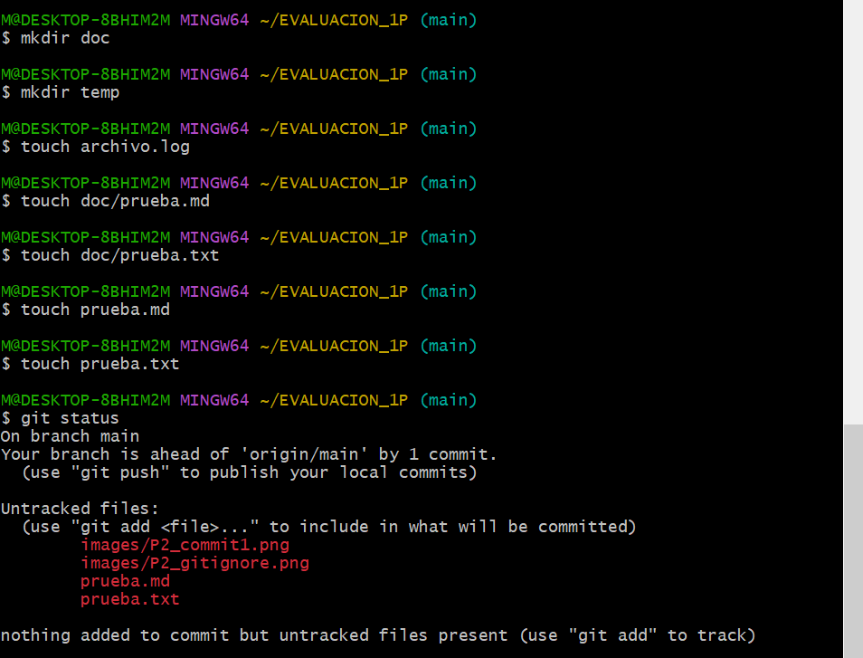

# Universidad Técnica de Ambato
## Facultad de Ingeniería en Sistemas, Electrónica e Industrial
### Carrera de Software  

**Asignatura:** Manejo y Configuración de Software  
**Nombre del Estudiante:** Robert Montesdeoca
**Fecha:** 08/04/2026

---

# Evaluación Práctica de Git y GitHub

## Instrucciones Generales

- Cada pregunta debe ser respondida directamente en este archivo **(README.md)** debajo del enunciado correspondiente. 
- Es importante que se coloque capturas de pantalla como evidencia de la parte práctica. Se recomienda crear una carpeta `images/` para almacenar las capturas de pantalla.
- Cada respuesta debe ir acompañada de uno o más **commits**, según se indique en cada pregunta.
- Cuando se indique, deberán realizarse acciones prácticas dentro del repositorio (como creación de archivos, ramas, resolución de conflictos, etc.).
- Cada pregunta debe estar **etiquetada con un tag**, únicamente en el commit final correspondiente, con el formato: `"Pregunta 1"`, `"Pregunta 2"`, etc.

---

## Pregunta 1 (1 punto)

**Explicar la diferencia entre los siguientes conceptos/comandos en Git y GitHub:**

- `git clone`  
- `fork`  
- `git pull`

### Parte práctica:

- Realizar un **fork** de este repositorio en la cuenta personal de GitHub del estudiante.
- Luego, realizar un **clone** del fork en el equipo local.
- En este README, describir el proceso seguido:
  - ¿Cómo se realizó el fork?
  - ¿Cómo se realizó el clone del fork?
  - ¿Cómo se verificó que se estaba trabajando sobre el fork y no sobre el repositorio original?
- Realizar en la rama `main` todo lo que corresponde a esta pregunta.

**📝 Respuesta:**

**Diferencias entre git clone, fork y git pull:**

- **`git clone`**: Es un comando de Git que copia un repositorio remoto (de GitHub) a tu máquina local, incluyendo todo el historial de commits. Se usa para trabajar localmente en un proyecto.

- **`fork`**: Es una funcionalidad de GitHub (no un comando de Git). Crea una copia completa de un repositorio ajeno en tu propia cuenta de GitHub, permitiendo experimentar sin afectar el repositorio original.

- **`git pull`**: Es un comando de Git que descarga los cambios más recientes del repositorio remoto y los fusiona automáticamente con tu rama local. Equivale a ejecutar `git fetch` + `git merge`.

**Proceso seguido:**

- **¿Cómo se realizó el fork?** Se ingresó al repositorio original de santiagojara/EVALUACION_1P en GitHub y se hizo clic en el botón "Fork", seleccionando mi cuenta personal (RobertM21-web) como destino.

- **¿Cómo se realizó el clone del fork?** Se copió la URL del fork desde el botón "Code" y se ejecutó en la terminal: `git clone https://github.com/RobertM21-web/EVALUACION_1P.git`

- **¿Cómo se verificó que se trabaja sobre el fork?** Se ejecutó el comando `git remote -v`, el cual mostró que la URL apunta a RobertM21-web/EVALUACION_1P y no al repositorio original.

---

## Pregunta 2 (1 punto)

**Configurar un archivo `.gitignore` para que ignore:**

- Todos los archivos con extensión `.log`.
- Una carpeta llamada `temp/`.
- Todos los archivos `.md` y `.txt`de la carpeta `doc/`. (Probar agregando un archivo `prueba.md` y un archivo `prueba.txt` dentro de la carpeta y fuera de la carpeta.)

### Requisitos:

1. Realizar un **primer commit** que incluya únicamente el archivo `.gitignore` con las reglas de exclusión definidas.
2. Realizar un **segundo commit** que incluya las creación de los archivos de prueba.
2. Realizar un **tercer commit** donde se explique en este README la función del archivo `.gitignore` y se muestre evidencia de que los archivos y carpetas indicadas no están siendo rastreadas por Git.

**Importante:**  
- Solo el **tercer commit** debe llevar el **tag `"Pregunta 2"`**.

**📝 Respuesta:**

**¿Qué es el archivo .gitignore?**

El archivo `.gitignore` permite definir reglas para que Git ignore archivos y carpetas específicas, evitando que sean rastreados o incluidos en los commits. Es útil para excluir archivos temporales, logs, dependencias y otros archivos innecesarios del control de versiones.

**Reglas configuradas en este proyecto:**

- `*.log` → Ignora todos los archivos con extensión `.log` en cualquier ubicación del proyecto.
- `temp/` → Ignora toda la carpeta `temp/` y su contenido.
- `doc/*.md` y `doc/*.txt` → Ignora los archivos `.md` y `.txt` que estén dentro de la carpeta `doc/`.

**Evidencia de funcionamiento:**

Al ejecutar `git status`, se comprobó que:
- `archivo.log` no aparece (ignorado correctamente).
- La carpeta `temp/` no aparece (ignorada correctamente).
- `doc/prueba.md` y `doc/prueba.txt` no aparecen (ignorados correctamente).
- `prueba.md` y `prueba.txt` sí aparecen, ya que están fuera de `doc/` y no están afectados por las reglas del `.gitignore`.

---

## Pregunta 3 (2 puntos)

**Utilizar Git Flow para desarrollar una nueva funcionalidad llamada `ingresar-encabezado`.**

### Requisitos:

- Inicializar el repositorio con Git Flow, utilizando las ramas por defecto: `main` y `develop`.
- Crear una rama de tipo `feature` con el nombre `ingresar-encabezado`.
- En dicha rama, **completar con los datos personales del estudiante** el encabezado que ya se encuentra al inicio de este archivo `README.md`.
- Realizar al menos un commit durante el desarrollo.
- Finalizar el hotfix siguiendo el flujo de trabajo establecido por Git Flow.

### En la sección de respuesta, se debe incluir:

- Los **comandos exactos** utilizados desde la inicialización de Git Flow hasta el cierre de la rama.
- Una descripción del **proceso seguido**, indicando el propósito de cada paso.
- Una reflexión sobre las **ventajas de aplicar Git Flow**, especialmente en contextos colaborativos o proyectos de larga duración.

**Importante:**

- Deben realizarse varios commits durante esta pregunta.
- **Solo el commit final** debe llevar el **tag `"Pregunta 3"`**.
- El flujo debe respetar la estructura de Git Flow con las ramas `develop` y `main`.

**📝 Respuesta:**

**Comandos utilizados:**

1. `git flow init` → Inicializa Git Flow en el repositorio, configurando las ramas principales (main y develop) y los prefijos para las ramas de soporte.
2. `git flow feature start ingresar-encabezado` → Crea una nueva rama feature/ingresar-encabezado a partir de develop y nos sitúa en ella.
3. `git add README.md` + `git commit -m "Completar encabezado con datos personales del estudiante"` → Se realizó el commit con los cambios del encabezado.
4. `git flow feature finish ingresar-encabezado` → Fusiona la rama feature en develop, elimina la rama feature y nos devuelve a develop.

**Descripción del proceso:**

- Se inicializó Git Flow con las ramas por defecto (main y develop).
- Se creó la rama feature/ingresar-encabezado para desarrollar la funcionalidad de forma aislada.
- En dicha rama se completaron los datos personales del estudiante en el encabezado del README.md.
- Al finalizar, se fusionó la feature en develop siguiendo el flujo de Git Flow.

**Ventajas de Git Flow:**

- Permite trabajar en nuevas funcionalidades de forma aislada sin afectar el código principal.
- Facilita la colaboración en equipo, ya que cada desarrollador puede trabajar en su propia rama feature sin conflictos.
- Mantiene un historial de commits limpio y organizado.
- Las ramas develop y main permiten separar el código en desarrollo del código en producción.
- En proyectos de larga duración, ayuda a gestionar múltiples versiones y correcciones de forma ordenada.

---

## Pregunta 4 (2 puntos)

**Trabajo con Issues y Pull Requests**

### Parte teórica:

- ¿Qué es un Pull Request y cuál es su función dentro de un flujo de trabajo colaborativo con Git y GitHub?
- ¿Por qué es importante revisar un Pull Request antes de fusionarlo con la rama principal?
- ¿Qué tipo de observaciones o validaciones se suelen realizar durante la revisión de un Pull Request?

### Parte práctica:

- Trabajar en la rama `develop`, ya existente desde la configuración de Git Flow.
- Realizar los cambios necesarios en este archivo `README.md` para responder las preguntas.
- Realizar un **commit** con los cambios de la primera pregunta y subirlo a la rama `develop` del repositorio remoto.
- Crear un **pull request** desde `develop` hacia `main` en GitHub, con el nombre `"Pregunta 4 - Apellido Nombre"`.
- Crear comentarios solicitando: 1. que se agregue la respuesta de la segunda pregunta y luego agregando la respuesta con el respectivo commit; y 2. el mismo procedimiento para la tercera pregunta.
- **Aprobar** el pull request para que se haga el merge respectivo hacia `main`.

### En la sección de respuesta, se debe incluir:

- Un resumen del procedimiento realizado con las respectivas preguntas y capturas.
- El número y enlace al pull request.

**📝 Respuesta:**

<!-- Escribe aquí tu respuesta completa a la Pregunta 4 -->

---

## Pregunta 5 (2 puntos)

**Resolver conflictos entre ramas y realizar un Pull Request**

### Requisitos:

- Crear dos ramas llamadas `ramaA` y `ramaB`, ambas a partir de la rama `develop`.
- En `ramaA`, crear un archivo llamado `archivoA.txt` con el contenido:  
  `Contenido A`
- En `ramaB`, crear un archivo con el mismo nombre (`archivoA.txt`), pero con el contenido:  
  `Contenido B`
- Intentar fusionar `ramaB` sobre `ramaA`, lo cual debe generar un conflicto.
- Resolver el conflicto combinando ambos contenidos.
- Realizar el merge de `ramaA` hacia `develop`.
- Crear un **pull request** desde `develop` hacia `main`.
- Una vez completado lo anterior, eliminar las ramas `ramaA` y `ramaB`.

### En la sección de respuesta, se debe incluir:

- El procedimiento completo:
  - Cómo se crearon las ramas.
  - Cómo se generó y resolvió el conflicto.
  - Cómo se realizó el merge hacia `develop`.
  - Cómo se eliminaron las ramas al finalizar.
- El enlace al pull request.
- Una breve explicación de qué es un conflicto en Git y por qué ocurrió en este caso.

**📝 Respuesta:**

<!-- Escribe aquí tu respuesta completa a la Pregunta 5 -->

---

## Pregunta 6 (2 puntos)

**Realizar limpieza, explicar versionamiento semántico y enviar cambios al repositorio original**

### Requisitos:

- Trabajar en la rama `develop` del fork del repositorio.
- Eliminar los archivos `archivoA.txt` y `archivoB.txt` creados en preguntas anteriores.
- Realizar un merge desde `develop` hacia `main` en el repositorio local.
- Enviar los cambios de la rama `main` local a la rama `develop` del repositorio remoto (fork). Recuerde incluir todos los tags creados (6 tags).
- Finalmente, crear un **pull request** desde la rama `develop` del fork hacia la rama `main` del repositorio original (del cual se realizó el fork en la Pregunta 1). El titulo del pull request debe ser `"NOMBRE APELLIDOS"`, en la descripción colocar el link de su repositorio de GitHub.

### En la sección de respuesta, se debe incluir:

- Una explicación del proceso realizado paso a paso.
- Una explicación del **versionamiento semántico**, indicando:
  - En qué consiste.
  - Sus tres componentes (MAJOR, MINOR, PATCH).
- Si hace falta agregar alguna evidencia adicional, agregue un tag adicional que sea `Version Final`.

**📝 Respuesta:**

<!-- Escribe aquí tu respuesta completa a la Pregunta 6 -->
